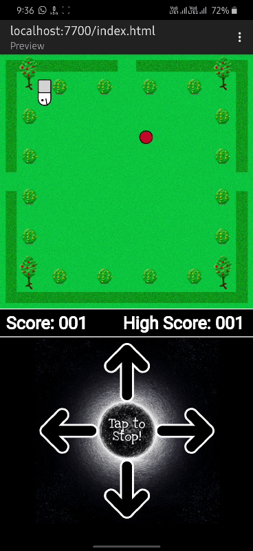

# Snake-Game
A Snake Game built using P5.js which is a library of JavaScript. The game is built by keeping the orientation as portrait to be playable on a mobile phone. There are an infinite number of features one can add to this game.

  

## Some Background of the Game
I made this game for **Gaming Booster 2020** hosted by **GirlScript Ireland** in August 2020 and they have also posted a [YouTube video](https://youtu.be/-MlAVoGSL1U) for the same.

## Contribution
You are welcome to contribute to this project and you don't need to have an expertise on coding. Kindly, go through this [Contribution](Contribution.md) guideline before proceeding.